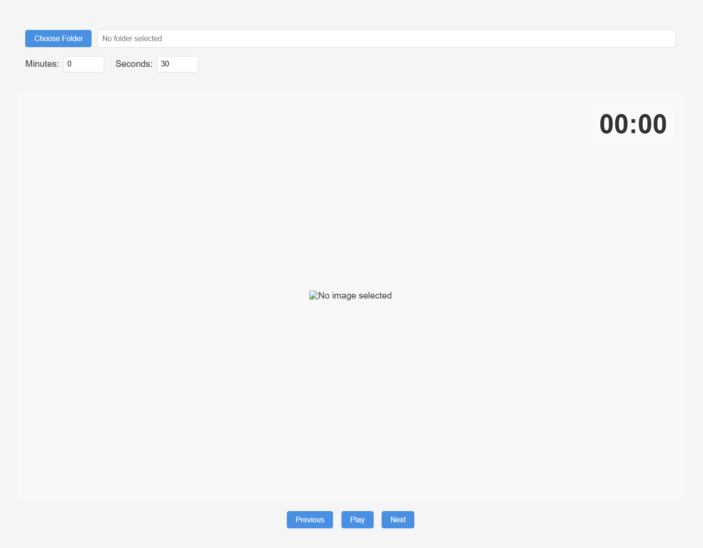
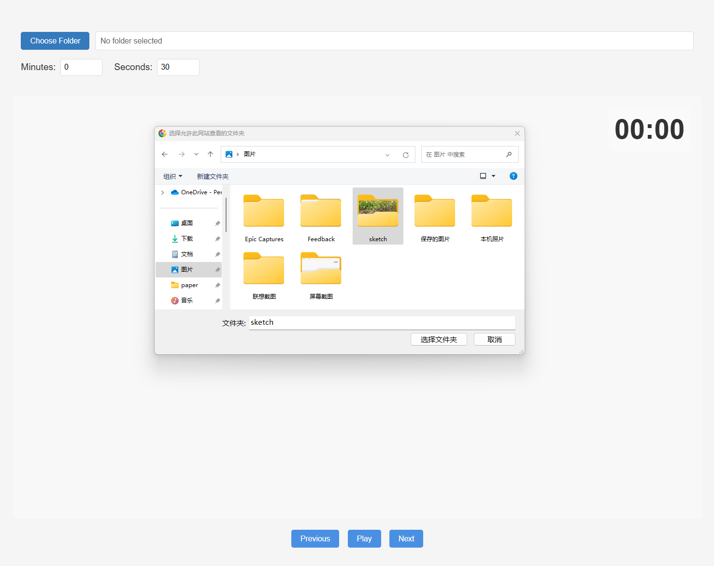
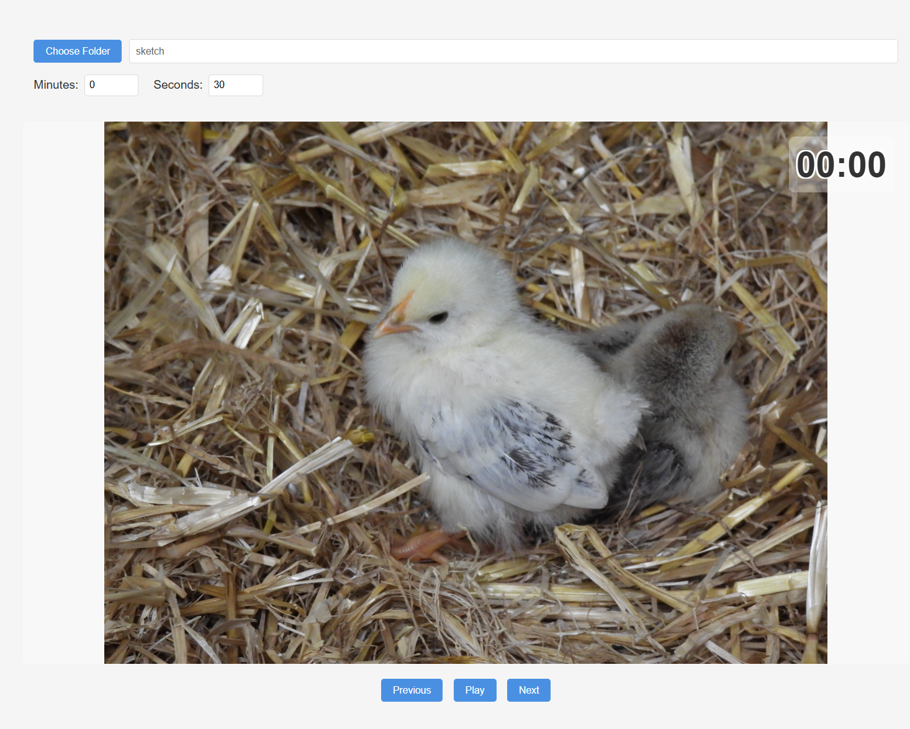
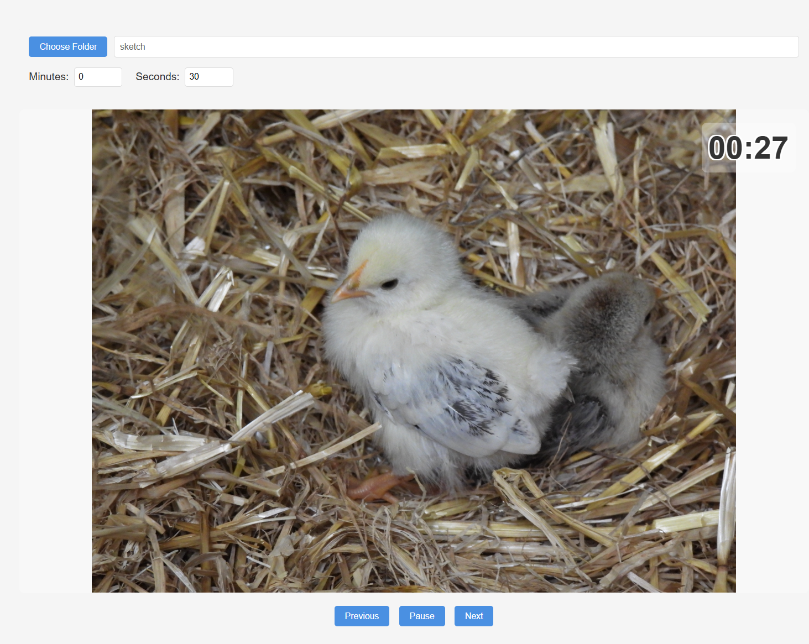

# PicTuner

PicTuner is a simple and lightweight web tool designed for sketch training. When practicing sketching for different purposes, the time spent on each sketch may vary. This tool allows users to set a timer to automatically switch through images in a folder, helping to streamline sketching exercises.

## Features
- **Custom Timer**: Set specific durations for displaying each image.
- **Folder Support**: Load images directly from a local folder for playback.
- **Progress Tracking**: Remembers the last displayed image for a given folder, allowing you to resume from where you left off.
- **User-Friendly Interface**: Minimalist design focused on ease of use.

## Interface
The website consists of the following main modules:
1. **Timer Module**: Allows users to set the time interval for image display.
2. **Image Display Module**: Displays the currently loaded image.
3. **Countdown Module**: Shows the remaining time before switching to the next image.
4. **Image Switch Module**: Automatically changes images based on the set timer.

### Screenshots
Below are a few screenshots of the application interface:

<table>
  <tr>
    <td></td>
    <td></td>
  </tr>
  <tr>
    <td></td>
    <td></td>
  </tr>
</table>

## How to Use
### Requirements
- No installation required.
- Any modern web browser that supports HTML, CSS, and JavaScript.

## Live Demo

PicTuner is now live on **GitHub Pages**! 🎉 You can access and use the application directly through the following link:

👉 [PicTuner Live Demo](https://berrylyte.github.io/PicTuner/)

No installation or setup is required—just open the link in your browser and start your sketch training!

### Installation and Setup
1. Clone the repository:
   ```bash
   git clone https://github.com/berrylyte/pictuner.git

2. Navigate to the project directory:
   ```bash
   cd pictuner

3. Open the `index.html` file in your web browser:
   ```bash
   open index.html   

### Example
You can load a local folder with images and set a 30-second timer for each image. The application will remember your progress and resume from the last viewed image when reopened.

## License
This project is licensed under the **MIT** License. See the `LICENSE file` for details.
